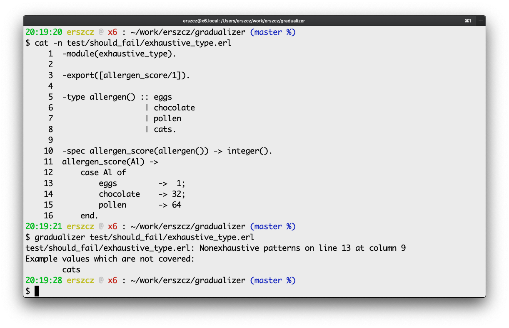

<h1 align="center">Gradualizer: A Gradual Type System for Erlang</h1>
<a href="https://github.com/josefs/Gradualizer/actions/workflows/build-and-test.yml">
  
</a>
<a href="https://hex.pm/packages/gradualizer">
  
</a>


## A type checker for Erlang

Gradualizer is a [_static type checker_][static-type-checker] for Erlang
with some support for [_gradual typing_][gradual-typing].
A static type checker catches bugs before we run a program thanks to type analysis.

[static-type-checker]: https://en.wikipedia.org/wiki/Type_system#Static_type_checking
[gradual-typing]: https://wphomes.soic.indiana.edu/jsiek/what-is-gradual-typing/

Gradualizer aims to integrate well into existing Erlang code bases in a non intrusive way.
It does so by

* having a type system that is based on the principles of Gradual Typing
* using the existing Erlang type spec syntax
* allowing for granular opting into type checking. Without any type specs, no static typing happens.
  When type specs are added the program is checked against
  these specs statically. The more type specs, the more static typing.

A picture is worth more than a thousand words:

[ ][examples]

[examples]: https://github.com/josefs/Gradualizer/blob/master/doc/examples.md


## Usage

### Command line

Compile the project as an escript. Then use it to check `.beam` files or `.erl` files.
Use the `-h` / `--help` option for help.

```
$ make escript
$ bin/gradualizer --help
Usage: gradualizer [options] [PATH...]
A type checker for Erlang/Elixir

       PATH                      Files or directories to type check
       --                        Signals that no more options will follow. The following
                                 arguments are treated as filenames, even if
                                 they start with hyphens.
  -h,  --help                    display this help and exit
       --infer                   Infer type information from literals and other
                                 language constructs
       --no_infer                Only use type information from function specs
                                  - the default behaviour
       --verbose                 Show what Gradualizer is doing
  -pa, --path_add                Add the specified directory to the beginning of
                                 the code path; see erl -pa             [string]
  -I                             Include path for Erlang source files; see -I in
                                 the manual page erlc(1)
       --stop_on_first_error     stop type checking at the first error
       --no_stop_on_first_error  inverse of --stop-on-first-error
                                  - the default behaviour
       --no_prelude              Do not override OTP specs.
       --specs_override_dir      Add specs overrides from the *.specs.erl files in
                                 this directory.
       --fmt_location            How to format location when pretty printing errors
                                 (Column is only available if analyzing from source)
                                 - 'none': no location for easier comparison
                                 - 'brief': for machine processing
                                   ("LINE:COLUMN:" before message text)
                                 - 'verbose' (default): for human readers
                                   ("on line LINE at column COLUMN" within the message text)
       --color [ COLOR ]         Use colors when printing fancy messages. An optional
                                 argument is `always | never | auto'. However, auto-
                                 detection of a TTY doesn't work when running as an escript.
       --no_color                Alias for `--color never'
       --fancy                   Use fancy error messages when possible (on by default)
       --no_fancy                Don't use fancy error messages.
       --union_size_limit        Performance hack: Unions larger than this value
                                 are replaced by any() in normalization (default: 30)
       --solve_constraints       Type check polymorphic calls (off by default)
```


### Rebar3

To run Gradualizer from rebar3, add it as a plugin in your `rebar.config`:

```erlang
{plugins, [
  {gradualizer, {git, "https://github.com/josefs/Gradualizer.git", {branch, "master"}}}
]}.
```

See [examples/rebar3/README.md](examples/rebar3/README.md).


### Elixir / Mix

Check out [Gradient](https://github.com/esl/gradient), the Elixir frontend to Gradualizer.
It provides a Mix task to use in your project:

```elixir
def deps do
  [
    {:gradient, github: "esl/gradient", only: [:dev], runtime: false}
  ]
end
```


### Erlang shell

Launch the interactive prompt with all the relevant modules in the path.
Then, use the functions in the `gradualizer` module:

```
$ make shell

1> gradualizer:type_check_file("path/to/some_file.erl").
```

You can also use the Rebar3 shell.


### Prerequisites

Gradualizer requires at least OTP 21 and is built using plain OTP
functionality and a self-contained Makefile.
Alternatively, it can be built using [rebar3](https://www.rebar3.org/),
as well as Mix if used as a dependency.


## Status

Gradualizer is close to a beta release. Most of the Erlang language constructs and
data types are handled, although there are things that don't work yet.
That being said, pull requests are most welcome!

A work-in-progress [Gradualizer manual](https://github.com/josefs/Gradualizer/wiki)
is located on the wiki.

For a non-exhaustive list of known problems, see `test/known_problems/`.
