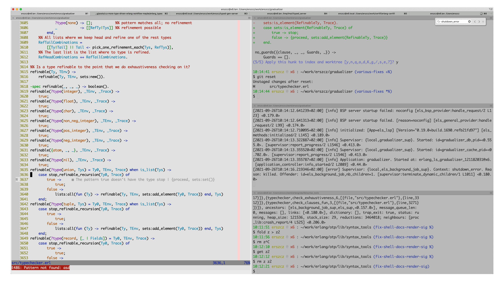

# Some examples of Gradualizer in action


Here's the same example in text for copy-pasting:

```erlang
     1	-module(exhaustive_type).
     2
     3	-export([allergen_score/1]).
     4
     5	-type allergen() :: eggs
     6	                  | chocolate
     7	                  | pollen
     8	                  | cats.
     9
    10	-spec allergen_score(allergen()) -> integer().
    11	allergen_score(Al) ->
    12	    case Al of
    13	        eggs         ->  1;
    14	        chocolate    -> 32;
    15	        pollen       -> 64
    16	    end.
```

```
$ gradualizer test/should_fail/exhaustive_type.erl
test/should_fail/exhaustive_type.erl: Nonexhaustive patterns on line 13 at column 9
Example values which are not covered:
	cats
```

[ErlangLS](https://github.com/erlang-ls/erlang_ls) integration example:


